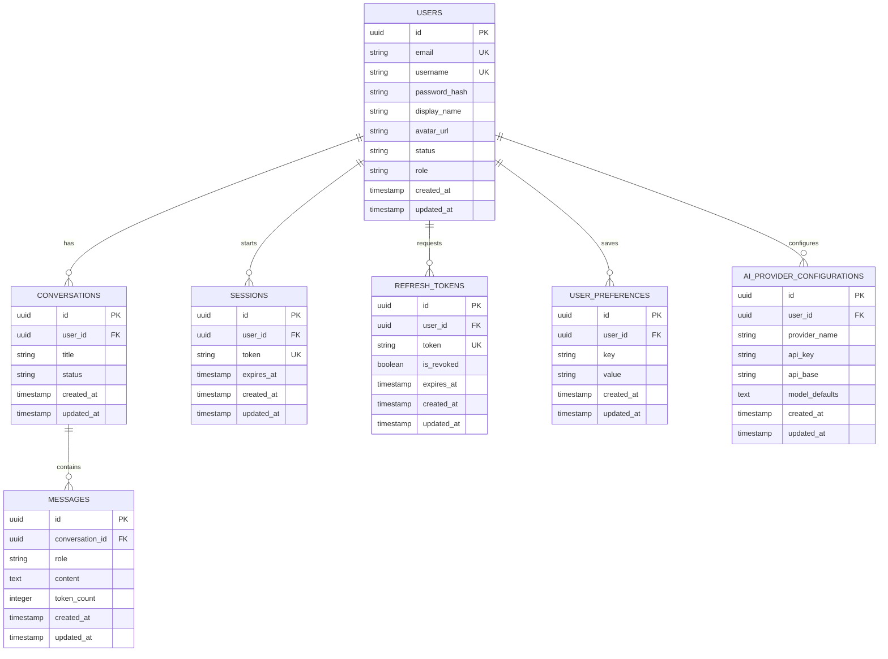

# Entity Relationship Diagram - Nova AI Database Foundation

This document defines the relational graph map for **Nova AI (Milestone M2.1)** using a Mermaid ER diagram.

---

## 1. ER Diagram

```mermaid
erDiagram
    USERS ||--o{ CONVERSATIONS : "has"
    USERS ||--o{ SESSIONS : "starts"
    USERS ||--o{ REFRESH_TOKENS : "requests"
    USERS ||--o{ USER_PREFERENCES : "saves"
    USERS ||--o{ AI_PROVIDER_CONFIGURATIONS : "configures"
    CONVERSATIONS ||--o{ MESSAGES : "contains"

    USERS {
        uuid id PK
        string email UK
        string username UK
        string password_hash
        string display_name
        string avatar_url
        string status
        string role
        timestamp created_at
        timestamp updated_at
    }

    CONVERSATIONS {
        uuid id PK
        uuid user_id FK
        string title
        string status
        timestamp created_at
        timestamp updated_at
    }

    MESSAGES {
        uuid id PK
        uuid conversation_id FK
        string role
        text content
        integer token_count
        timestamp created_at
        timestamp updated_at
    }

    SESSIONS {
        uuid id PK
        uuid user_id FK
        string token UK
        timestamp expires_at
        timestamp created_at
        timestamp updated_at
    }

    REFRESH_TOKENS {
        uuid id PK
        uuid user_id FK
        string token UK
        boolean is_revoked
        timestamp expires_at
        timestamp created_at
        timestamp updated_at
    }

    USER_PREFERENCES {
        uuid id PK
        uuid user_id FK
        string key
        string value
        timestamp created_at
        timestamp updated_at
    }

    AI_PROVIDER_CONFIGURATIONS {
        uuid id PK
        uuid user_id FK
        string provider_name
        string api_key
        string api_base
        text model_defaults
        timestamp created_at
        timestamp updated_at
    }
```
